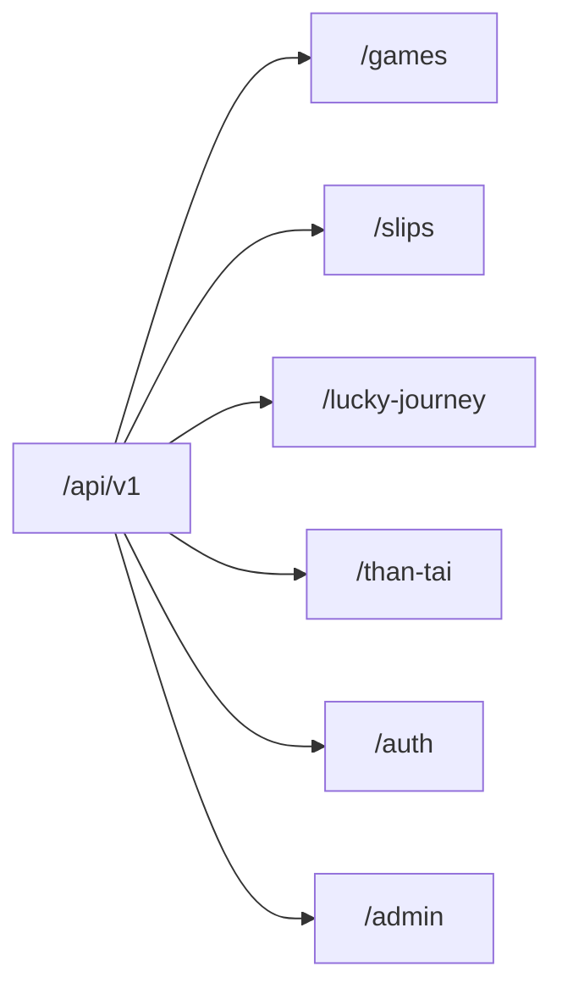

# 🌐 ĐẶC TẢ GIAO DIỆN LẬP TRÌNH ỨNG DỤNG (REST API SPECIFICATION)
# Dự án: Bịp lót — *Cơ hội để nát hơn*

---

## 1. NGUYÊN TẮC THIẾT KẾ RESTFUL API

- **Phiên bản (Versioning):** Định tuyến tiền tố `/api/v1/...`
- **Định dạng dữ liệu:** Chuẩn `application/json` (UTF-8)
- **Chuẩn báo lỗi (Error Handling):** Tuân thủ **RFC 7807 Problem Details for HTTP APIs**
- **Xác thực (Authentication):** Bearer Token (JWT) gửi qua header `Authorization: Bearer <token>` hoặc Cookie an toàn `HttpOnly`.
- **Guest Tracking:** Header tùy chọn `X-Guest-Session-Token: <uuid>` để nhận diện phiên khách vãng lai khi chưa đăng nhập.

---

## 2. CHUẨN PHẢN HỒI (STANDARD RESPONSE FORMAT)

### 2.1. Phản hồi Thành công (Success Envelope)
```json
{
  "success": true,
  "data": { ... },
  "message": "Thao tác thành công",
  "timestamp": "2026-08-26T11:50:00Z"
}
```

### 2.2. Phản hồi Lỗi (RFC 7807 Problem Details)
```json
{
  "type": "https://biplot.vn/errors/invalid-game-rule",
  "title": "Dữ liệu chọn số không hợp lệ",
  "status": 400,
  "detail": "Số 56 vượt quá dải số tối đa (55) của game Power 6/55",
  "instance": "/api/v1/slips/validate",
  "errors": {
    "Numbers[5]": ["Giá trị phải nằm trong khoảng từ 1 đến 55"]
  }
}
```

---

## 3. CHI TIẾT DANH MỤC ENDPOINTS



---

### 3.1. Phân hệ Game (`/api/v1/games`)

#### `GET /api/v1/games`
- **Mô tả:** Lấy danh sách tất cả các trò chơi đang kích hoạt kèm cấu hình Pool.
- **Quyền hạn:** Public
- **Response `200 OK`:**
```json
{
  "success": true,
  "data": [
    {
      "id": 1,
      "code": "POWER_655",
      "name": "Power 6/55",
      "description": "Cơ hội đổi đời hoặc đổi chỗ ngủ",
      "pools": [
        {
          "poolIndex": 0,
          "name": "Số chính",
          "minNumber": 1,
          "maxNumber": 55,
          "pickCount": 6,
          "allowDuplicates": false,
          "badgeColor": "#EF4444"
        }
      ]
    },
    {
      "id": 3,
      "code": "LOTTO_535",
      "name": "Lotto 5/35",
      "description": "5 số chính và 1 số vận mệnh",
      "pools": [
        {
          "poolIndex": 0,
          "name": "Dãy chính",
          "minNumber": 1,
          "maxNumber": 35,
          "pickCount": 5,
          "allowDuplicates": false,
          "badgeColor": "#F97316"
        },
        {
          "poolIndex": 1,
          "name": "Số đặc biệt",
          "minNumber": 1,
          "maxNumber": 12,
          "pickCount": 1,
          "allowDuplicates": false,
          "badgeColor": "#FACC15"
        }
      ]
    }
  ]
}
```

---

### 3.2. Phân hệ Lucky Journey (`/api/v1/lucky-journey`)

#### `POST /api/v1/lucky-journey/next-question`
- **Mô tả:** Lấy câu hỏi tiếp theo được tối ưu bởi Novelty Engine (không trùng câu đã hỏi trong dòng, giảm trọng số câu/theme vừa gặp).
- **Request Body:**
```json
{
  "gameCode": "POWER_655",
  "poolIndex": 0,
  "currentLineNumbers": [7, 18],
  "answeredQuestionIdsInLine": [102, 105]
}
```
- **Response `200 OK`:**
```json
{
  "success": true,
  "data": {
    "questionId": 208,
    "themeCode": "THEME_WORK",
    "themeName": "Chuyện công sở",
    "questionType": "ThisOrThat",
    "content": "Sáng thứ 2 bước vào văn phòng, bạn muốn điều gì xảy ra hơn?",
    "subtitle": "Chọn thật lòng, số sẽ thật tâm",
    "mediaUrl": null,
    "choices": [
      {
        "choiceId": 512,
        "content": "Sếp đi công tác nguyên tuần",
        "subContent": "Văn phòng tự do muôn năm",
        "orderIndex": 1
      },
      {
        "choiceId": 513,
        "content": "Máy pha cà phê công ty sửa xong",
        "subContent": "Nạp caffein chiến đấu deadline",
        "orderIndex": 2
      }
    ]
  }
}
```

#### `POST /api/v1/lucky-journey/reveal-number`
- **Mô tả:** Gửi lựa chọn của người dùng $\rightarrow$ Chạy thuật toán Candidate Scoring + Weighted Random $\rightarrow$ Mở con số tương ứng ngay lập tức.
- **Request Body:**
```json
{
  "gameCode": "POWER_655",
  "poolIndex": 0,
  "questionId": 208,
  "choiceId": 512,
  "excludedNumbers": [7, 18],
  "currentOrderIndex": 3
}
```
- **Response `200 OK`:**
```json
{
  "success": true,
  "data": {
    "revealedNumber": 32,
    "formattedNumber": "32",
    "poolIndex": 0,
    "source": "Lucky",
    "commentary": "Số 32: Năng lượng tự do bung tỏa!",
    "metadata": {
      "questionId": 208,
      "choiceId": 512,
      "dominantTrait": "ChaosEnergy",
      "revealedAt": "2026-08-26T11:52:10Z"
    }
  }
}
```

---

### 3.3. Phân hệ Thần Tài (`/api/v1/than-tai`)

#### `POST /api/v1/than-tai/generate-line`
- **Mô tả:** Sinh nhanh trọn vẹn một dòng bộ số theo chiến lược Thần Tài.
- **Request Body:**
```json
{
  "gameCode": "POWER_655",
  "strategy": "Balanced",
  "excludedNumbers": []
}
```
- **Response `200 OK`:**
```json
{
  "success": true,
  "data": {
    "strategy": "Balanced",
    "numbers": [
      { "value": 4, "formatted": "04", "poolIndex": 0, "source": "Random" },
      { "value": 15, "formatted": "15", "poolIndex": 0, "source": "Random" },
      { "value": 22, "formatted": "22", "poolIndex": 0, "source": "Random" },
      { "value": 37, "formatted": "37", "poolIndex": 0, "source": "Random" },
      { "value": 44, "formatted": "44", "poolIndex": 0, "source": "Random" },
      { "value": 51, "formatted": "51", "poolIndex": 0, "source": "Random" }
    ],
    "commentary": "Thần Tài cân bằng âm dương, chẵn lẻ vuông tròn!"
  }
}
```

---

### 3.4. Phân hệ Phiếu số (`/api/v1/slips`)

#### `POST /api/v1/slips`
- **Mô tả:** Lưu phiếu số (hỗ trợ cả Guest có `X-Guest-Session-Token` lẫn Member có JWT).
- **Request Body:**
```json
{
  "gameCode": "POWER_655",
  "title": "Vé số cầu may cuối tháng",
  "lines": [
    {
      "lineLabel": "A",
      "status": "Complete",
      "numbers": [
        { "value": 7, "poolIndex": 0, "source": "Manual" },
        { "value": 18, "poolIndex": 0, "source": "Manual" },
        { "value": 32, "poolIndex": 0, "source": "Lucky", "metadataJson": "{...}" },
        { "value": 41, "poolIndex": 0, "source": "Lucky", "metadataJson": "{...}" },
        { "value": 49, "poolIndex": 0, "source": "Random" },
        { "value": 55, "poolIndex": 0, "source": "Random" }
      ]
    }
  ]
}
```
- **Response `201 Created`:**
```json
{
  "success": true,
  "data": {
    "slipId": "b1f3c099-2470-4f51-9311-968603ff3cb7",
    "slipCode": "BIP-66912",
    "shareUrl": "https://biplot.vn/s/BIP-66912",
    "createdAt": "2026-08-26T11:55:00Z"
  }
}
```

#### `POST /api/v1/slips/sync-guest`
- **Mô tả:** Chuyển toàn bộ phiếu tạo bởi Guest Session vào tài khoản của User sau khi đăng ký/đăng nhập.
- **Request Body:**
```json
{
  "guestSessionToken": "d4e2a890-8e65-4ef0-bf4a-0a71fef27991"
}
```
- **Response `200 OK`:** Báo số lượng phiếu đã được liên kết thành công.

---

### 3.5. Phân hệ Xác thực (`/api/v1/auth`)

- `POST /api/v1/auth/register`: Đăng ký tài khoản mới (Email, Mật khẩu, Tên hiển thị).
- `POST /api/v1/auth/login`: Đăng nhập, nhận JWT Access Token và Refresh Token.
- `POST /api/v1/auth/refresh-token`: Cấp mới Access Token khi hết hạn.
- `GET /api/v1/auth/me`: Lấy thông tin cá nhân và vai trò (Roles).

---

### 3.6. Phân hệ Quản trị (`/api/v1/admin`)

- `POST /api/v1/admin/content/import-bulk`: Nhận file `.xlsx` / `.csv` để kiểm tra và nạp hàng loạt câu hỏi.
- `GET /api/v1/admin/questions`: Danh sách câu hỏi kèm phân trang, lọc theo Theme và Trạng thái.
- `POST /api/v1/admin/questions`: Thêm câu hỏi thủ công.
- `PUT /api/v1/admin/questions/{id}`: Cập nhật câu hỏi và danh sách đáp án.
- `GET /api/v1/admin/stats/overview`: Thống kê tổng số phiếu đã sinh, tỷ lệ chọn từng game, câu hỏi hot.
