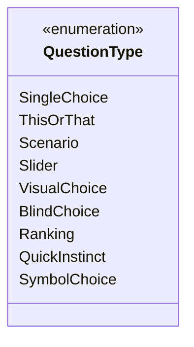
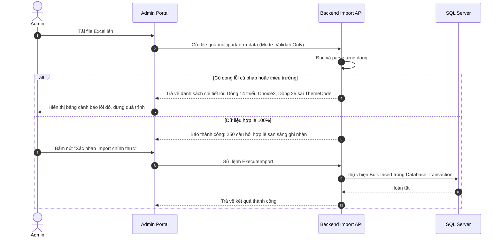

# 📚 HỆ THỐNG NỘI DUNG & ĐẶC TẢ CÂU HỎI (CONTENT SYSTEM SPEC)
# Dự án: Bịp lót — *Cơ hội để nát hơn*

---

## 1. NGUYÊN TẮC QUẢN TRỊ NỘI DUNG (DATA-DRIVEN PRINCIPLES)

1. **Tuyệt đối không hard-code câu hỏi trong mã nguồn Frontend / Backend.**
2. Toàn bộ câu hỏi, đáp án, danh mục chủ đề, hình ảnh minh họa và trọng số tính cách đều được lưu trữ trong Cơ sở dữ liệu và quản lý qua Admin CMS.
3. Cấu trúc bảng và Index được thiết kế sẵn sàng mở rộng đến **100,000+ câu hỏi** mà vẫn đảm bảo tốc độ truy vấn ngẫu nhiên $< 10\text{ms}$.

---

## 2. 9 DẠNG CÂU HỎI HỖ TRỢ TRONG V1 (9 QUESTION TYPES)

### 2.1. `SingleChoice` (Trắc nghiệm Tiêu chuẩn)
- **Mô tả:** Câu hỏi gồm $3 - 4$ lựa chọn dạng thẻ bấm dọc/ngang tiêu chuẩn.
- **Ví dụ:** *"Cuối tuần này kế hoạch tiêu tiền của bạn là gì?"*
  - A. Trả nợ thẻ tín dụng.
  - B. Đi ăn lẩu tự an ủi tâm hồn.
  - C. Nạp game gacha hy vọng đổi đời.

### 2.2. `ThisOrThat` (Đối đầu 1v1)
- **Mô tả:** Chỉ có đúng 2 thẻ lớn đối kháng trực diện, so sánh 2 thái cực hài hước.
- **Ví dụ:** *"Bạn thà chọn điều nào hơn?"*
  - Thẻ 1: Họp online bật camera cả ngày nhưng được về đúng 17h.
  - Thẻ 2: Không cần họp nhưng phải OT đến 21h mỗi ngày.

### 2.3. `Scenario` (Tình huống Kịch tính)
- **Mô tả:** Có một đoạn dẫn truyện ngắn đặt người chơi vào tình thế nan giải, kèm các phản ứng tự trào.
- **Ví dụ:** *"Bạn vô tình gửi tin nhắn nói xấu Sếp vào thẳng nhóm chat chung có Sếp..."*
  - Đáp án 1: Thu hồi tin nhắn và giả vờ bị hack tài khoản.
  - Đáp án 2: Gửi tiếp 'Hahaha em đùa đấy' rồi nộp đơn từ chức.
  - Đáp án 3: Giữ nguyên hiện trường và chuẩn bị tâm lý lãnh thưởng Jackpot.

### 2.4. `Slider` (Thanh trượt Cảm xúc)
- **Mô tả:** Người dùng kéo thanh trượt từ $0\%$ đến $100\%$ hoặc qua các nấc cảm xúc.
- **Nấc giá trị:** `0: Nát sương sương` $\rightarrow$ `50: Bất ổn định` $\rightarrow$ `100: Nát toàn phần`.
- **Ví dụ:** *"Đo mức độ kiệt quệ tài chính của bạn trước ngày nhận lương:"*

### 2.5. `VisualChoice` (Thẻ hình ảnh / Icon sinh động)
- **Mô tả:** Các đáp án đi kèm Icon sinh động hoặc hình minh họa châm biếm.
- **Ví dụ:** *"Chọn một biểu tượng miêu tả tâm trạng của bạn hôm nay:"*
  - 🤡 Chú hề công sở.
  - 📉 Đồ thị nến đỏ rơi tự do.
  - 🛌 Nằm yên không làm gì.

### 2.6. `BlindChoice` (Hộp quà bí ẩn / Lật thẻ Tarot)
- **Mô tả:** Người chơi chỉ thấy $3 - 4$ thẻ bài úp mặt bí ẩn (Ví dụ: Lá bài 1, Lá bài 2, Lá bài 3). Khi chạm vào, thẻ bài lật mặt và tiết lộ nội dung số phận cùng con số.

### 2.7. `Ranking` (Xếp hạng Ưu tiên)
- **Mô tả:** Kéo thả sắp xếp $3 - 4$ mục theo thứ tự quan trọng giảm dần.
- **Ví dụ:** *"Sắp xếp thứ tự ưu tiên nếu bạn trúng 100 tỷ:"*
  - 1. Mua nhà cho bố mẹ.
  - 2. Đổi điện thoại xịn.
  - 3. Block sếp và đồng nghiệp hãm.

### 2.8. `QuickInstinct` (Bản năng chớp nhoáng / Đếm ngược)
- **Mô tả:** Thẻ câu hỏi có đồng hồ đếm ngược $5$ giây. Người chơi phải bấm theo phản xạ đầu tiên mà không kịp suy nghĩ.

### 2.9. `SymbolChoice` (Biểu tượng Phong thủy / Tâm linh Meme)
- **Mô tả:** Chọn theo Cung hoàng đạo, Mệnh phong thủy (Kim - Mộc - Thủy - Hỏa - Thổ), hoặc các linh vật meme (Mèo thần tài, Cóc ngậm tiền, Vịt vàng bối rối).

---

## 3. HỆ THỐNG CHỦ ĐỀ & TRAITS (THEMES & TRAITS TAXONOMY)

### 3.1. Danh mục Chủ đề (Themes)
1. `THEME_WORK`: Chuyện công sở, Deadline, Drama đồng nghiệp, KPI, Tăng lương.
2. `THEME_FINANCE`: Đu đỉnh chứng khoán/crypto, Trả góp, Cháy túi cuối tháng, Mua sắm bốc đồng.
3. `THEME_LOVE`: Ế lâu năm, Người yêu cũ, Hẹn hò bất ổn, Thính dạo.
4. `THEME_SPIRIT`: Tâm linh văn phòng, Coi bói dạo, Giải mã giấc mơ, Xin quẻ đầu năm.
5. `THEME_LIFESTYLE`: Thức khuya, Ăn vặt, Tập gym bỏ dở, Lười biếng tích cực.

### 3.2. Danh mục Thuộc tính Vận mệnh (Traits)
Mỗi lựa chọn được gán điểm vào các trục Trait:
- `RiskTolerance`: Mức độ liều lĩnh / dám chơi lớn.
- `ChaosEnergy`: Năng lượng bất ổn / thích nổi loạn.
- `SpiritualVibe`: Độ nhạy cảm tâm linh / tin vào trực giác.
- `DesperationLevel`: Mức độ 'nát' / khát khao đổi đời.
- `Patience`: Độ kiên nhẫn / trầm tĩnh.
- `MemeAffinity`: Độ hài hước / bắt trend mạng xã hội.

---

## 4. QUY CÁCH IMPORT HÀNG LOẠT (BULK IMPORT SPECIFICATION)

Hệ thống Admin hỗ trợ import câu hỏi hàng loạt thông qua tệp tin Excel (`.xlsx`), CSV (`.csv`) hoặc JSON (`.json`).

### 4.1. Cấu trúc Cột chuẩn trong File Excel / CSV

| Tên Cột (Header) | Kiểu dữ liệu | Bắt buộc | Mô tả |
| :--- | :--- | :---: | :--- |
| `ThemeCode` | String | Có | Mã chủ đề (VD: `THEME_WORK`, `THEME_FINANCE`) |
| `QuestionType` | String | Có | Dạng câu hỏi (VD: `SingleChoice`, `ThisOrThat`) |
| `Content` | String | Có | Nội dung câu hỏi |
| `Subtitle` | String | Không | Lời dẫn ngắn phụ / chú thích |
| `Choice1_Text` | String | Có | Nội dung đáp án 1 |
| `Choice1_Traits` | String | Không | Danh sách Trait (VD: `ChaosEnergy:0.8;RiskTolerance:0.5`) |
| `Choice2_Text` | String | Có | Nội dung đáp án 2 |
| `Choice2_Traits` | String | Không | Danh sách Trait cho đáp án 2 |
| `Choice3_Text` | String | Không | Nội dung đáp án 3 |
| `Choice3_Traits` | String | Không | Danh sách Trait cho đáp án 3 |
| `Choice4_Text` | String | Không | Nội dung đáp án 4 |
| `Choice4_Traits` | String | Không | Danh sách Trait cho đáp án 4 |
| `IsActive` | Boolean | Có | `TRUE` / `FALSE` |

### 4.2. Quy trình Xử lý & Xác thực (Dry-Run Import Pipeline)

