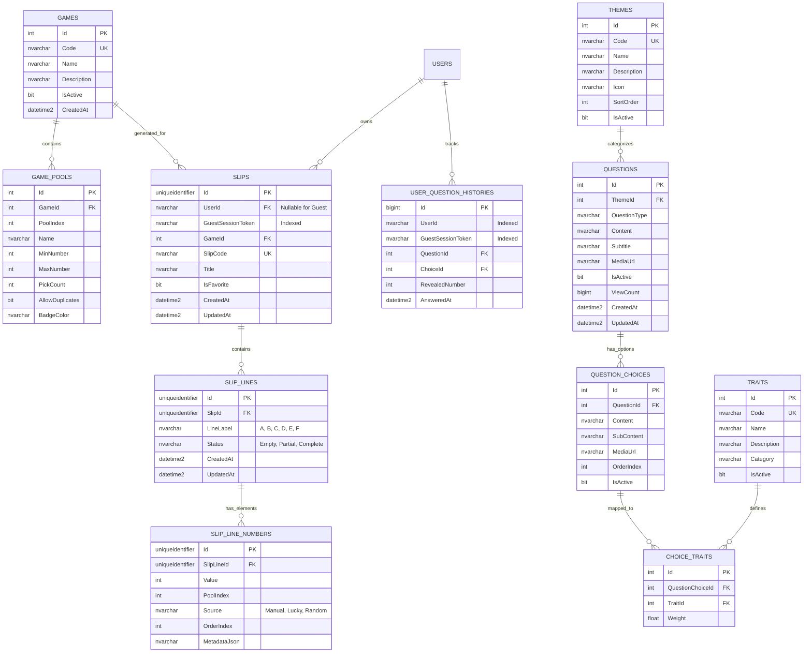

# 🗄️ THIẾT KẾ CƠ SỞ DỮ LIỆU (DATABASE SPECIFICATION)
# Dự án: Bịp lót — *Cơ hội để nát hơn*

---

## 1. TỔNG QUAN HỆ CƠ SỞ DỮ LIỆU

- **Hệ quản trị CSDL:** Microsoft SQL Server 2022+
- **ORM:** Entity Framework Core 10 (Code-First Approach, .NET 10 LTS)
- **Quy ước đặt tên (Naming Convention):**
  - Bảng: PascalCase số nhiều (`Games`, `Questions`, `Slips`).
  - Cột: PascalCase (`Id`, `CreatedAt`, `QuestionType`).
  - Khoá chính: `Id` kiểu `INT` (với dữ liệu danh mục/nội dung) hoặc `UNIQUEIDENTIFIER` / `BIGINT` (với dữ liệu transaction/phiếu số).

---

## 2. SƠ ĐỒ THỰC THỂ QUAN HỆ (ERD - ENTITY RELATIONSHIP DIAGRAM)

---

## 3. ĐẶC TẢ CHI TIẾT CÁC BẢNG DỮ LIỆU

### 3.1. Phân hệ Game & Luật chơi

#### Bảng `Games`
| Cột | Kiểu | Nullable | Ràng buộc | Mô tả |
| :--- | :--- | :---: | :--- | :--- |
| `Id` | `int` | Không | `PK, Identity` | Mã định danh game |
| `Code` | `nvarchar(50)` | Không | `Unique` | Mã code: `POWER_655`, `MEGA_645`, `LOTTO_535` |
| `Name` | `nvarchar(100)`| Không | | Tên game: "Power 6/55", "Mega 6/45" |
| `Description` | `nvarchar(500)`| Có | | Mô tả ngắn / câu đùa về game |
| `IsActive` | `bit` | Không | `Default: 1` | Trạng thái kích hoạt |
| `CreatedAt` | `datetime2` | Không | `Default: sysutcdatetime()` | Thời gian tạo |

#### Bảng `GamePools`
| Cột | Kiểu | Nullable | Ràng buộc | Mô tả |
| :--- | :--- | :---: | :--- | :--- |
| `Id` | `int` | Không | `PK, Identity` | Định danh Pool |
| `GameId` | `int` | Không | `FK -> Games(Id)` | Thuộc Game nào |
| `PoolIndex` | `int` | Không | | Thứ tự Pool (0: Chính, 1: Phụ) |
| `Name` | `nvarchar(100)`| Không | | Tên Pool ("Dãy chính", "Số đặc biệt") |
| `MinNumber` | `int` | Không | | Số nhỏ nhất (VD: 1) |
| `MaxNumber` | `int` | Không | | Số lớn nhất (VD: 55, 45, 35, 12) |
| `PickCount` | `int` | Không | | Số lượng bắt buộc phải chọn |
| `AllowDuplicates` | `bit` | Không | `Default: 0` | Cho phép trùng lặp trong Pool |
| `BadgeColor`| `nvarchar(20)` | Có | | Mã màu sắc (`#EF4444`, `#F59E0B`) |

---

### 3.2. Phân hệ Phiếu số (Slips & Numbers)

#### Bảng `Slips`
| Cột | Kiểu | Nullable | Ràng buộc | Mô tả |
| :--- | :--- | :---: | :--- | :--- |
| `Id` | `uniqueidentifier` | Không | `PK, Default: NEWID()` | Mã định danh phiếu |
| `UserId` | `nvarchar(450)` | Có | `FK -> AspNetUsers(Id)` | User sở hữu (Null nếu là Guest) |
| `GuestSessionToken` | `nvarchar(100)` | Có | `Index` | Token phiên Guest để truy vấn |
| `GameId` | `int` | Không | `FK -> Games(Id)` | Thuộc game nào |
| `SlipCode` | `nvarchar(30)` | Không | `Unique` | Mã phiếu ngẫu nhiên (VD: `BIP-88492`) |
| `Title` | `nvarchar(150)`| Có | | Tiêu đề ghi chú do người dùng đặt |
| `IsFavorite` | `bit` | Không | `Default: 0` | Đánh dấu yêu thích |
| `CreatedAt` | `datetime2` | Không | `Default: sysutcdatetime()` | Thời gian tạo |
| `UpdatedAt` | `datetime2` | Không | `Default: sysutcdatetime()` | Thời gian sửa |

#### Bảng `SlipLines`
| Cột | Kiểu | Nullable | Ràng buộc | Mô tả |
| :--- | :--- | :---: | :--- | :--- |
| `Id` | `uniqueidentifier` | Không | `PK, Default: NEWID()` | Mã định danh dòng |
| `SlipId` | `uniqueidentifier` | Không | `FK -> Slips(Id) CASCADE` | Thuộc phiếu nào |
| `LineLabel` | `nvarchar(5)` | Không | | Ký tự dòng: `A`, `B`, `C`, `D`, `E`, `F` |
| `Status` | `nvarchar(20)` | Không | `Default: 'Empty'` | `Empty`, `Partial`, `Complete` |
| `CreatedAt` | `datetime2` | Không | `Default: sysutcdatetime()` | Thời gian tạo |
| `UpdatedAt` | `datetime2` | Không | `Default: sysutcdatetime()` | Thời gian sửa |

#### Bảng `SlipLineNumbers`
| Cột | Kiểu | Nullable | Ràng buộc | Mô tả |
| :--- | :--- | :---: | :--- | :--- |
| `Id` | `uniqueidentifier` | Không | `PK, Default: NEWID()` | Định danh con số |
| `SlipLineId`| `uniqueidentifier` | Không | `FK -> SlipLines(Id) CASCADE`| Thuộc dòng nào |
| `Value` | `int` | Không | | Giá trị con số (1 - 55) |
| `PoolIndex` | `int` | Không | `Default: 0` | Thuộc Pool nào |
| `Source` | `nvarchar(20)` | Không | | Nguồn tạo: `Manual`, `Lucky`, `Random` |
| `OrderIndex`| `int` | Không | | Thứ tự chọn số (1 đến 6) |
| `MetadataJson` | `nvarchar(max)` | Có | | Lưu câu hỏi, đáp án, phong cách random |

---

### 3.3. Phân hệ Nội dung (Questions, Choices, Traits)

#### Bảng `Themes`
| Cột | Kiểu | Nullable | Ràng buộc | Mô tả |
| :--- | :--- | :---: | :--- | :--- |
| `Id` | `int` | Không | `PK, Identity` | Định danh Theme |
| `Code` | `nvarchar(50)` | Không | `Unique` | Mã: `THEME_WORK`, `THEME_FINANCE` |
| `Name` | `nvarchar(100)`| Không | | Tên hiển thị ("Chuyện công sở", "Đu đỉnh") |
| `Description` | `nvarchar(500)`| Có | | Mô tả chủ đề |
| `Icon` | `nvarchar(50)` | Có | | Icon identifier |
| `SortOrder` | `int` | Không | `Default: 0` | Thứ tự ưu tiên hiển thị |
| `IsActive` | `bit` | Không | `Default: 1` | Trạng thái kích hoạt |

#### Bảng `Questions`
| Cột | Kiểu | Nullable | Ràng buộc | Mô tả |
| :--- | :--- | :---: | :--- | :--- |
| `Id` | `int` | Không | `PK, Identity` | Định danh câu hỏi |
| `ThemeId` | `int` | Không | `FK -> Themes(Id)` | Thuộc chủ đề nào |
| `QuestionType` | `nvarchar(30)` | Không | | `SingleChoice`, `ThisOrThat`, `Slider`... |
| `Content` | `nvarchar(1000)`| Không | | Nội dung văn bản câu hỏi |
| `Subtitle` | `nvarchar(500)`| Có | | Lời dẫn giải thích phụ |
| `MediaUrl` | `nvarchar(500)`| Có | | Link ảnh / video minh họa |
| `IsActive` | `bit` | Không | `Default: 1` | Kích hoạt |
| `ViewCount` | `bigint` | Không | `Default: 0` | Số lần câu hỏi đã được hiển thị |
| `CreatedAt` | `datetime2` | Không | `Default: sysutcdatetime()` | Thời gian tạo |
| `UpdatedAt` | `datetime2` | Không | `Default: sysutcdatetime()` | Thời gian sửa |

#### Bảng `QuestionChoices`
| Cột | Kiểu | Nullable | Ràng buộc | Mô tả |
| :--- | :--- | :---: | :--- | :--- |
| `Id` | `int` | Không | `PK, Identity` | Định danh đáp án |
| `QuestionId`| `int` | Không | `FK -> Questions(Id) CASCADE`| Thuộc câu hỏi nào |
| `Content` | `nvarchar(500)`| Không | | Nội dung đáp án |
| `SubContent`| `nvarchar(255)`| Có | | Nội dung chú thích thêm của đáp án |
| `MediaUrl` | `nvarchar(500)`| Có | | Icon / Ảnh của đáp án |
| `OrderIndex`| `int` | Không | `Default: 0` | Thứ tự hiển thị |
| `IsActive` | `bit` | Không | `Default: 1` | Kích hoạt |

#### Bảng `Traits` & `ChoiceTraits`
- `Traits`: Chứa danh mục các đặc tính vận mệnh (`Id`, `Code`, `Name`, `Description`, `Category`, `IsActive`).
- `ChoiceTraits`: Bảng liên kết nhiều-nhiều giữa `QuestionChoices` và `Traits` với trọng số `Weight` kiểu `float` (từ `-1.0` đến `+1.0`).

---

### 3.4. Phân hệ Lịch sử & Cấu hình (Novelty & Engine Config)

#### Bảng `UserQuestionHistories`
- Theo dõi lịch sử trả lời để phục vụ Novelty Engine:
  - `Id` (`bigint`, PK)
  - `UserId` (`nvarchar(450)`, Nullable, Index)
  - `GuestSessionToken` (`nvarchar(100)`, Nullable, Index)
  - `QuestionId` (`int`, FK)
  - `ChoiceId` (`int`, FK)
  - `RevealedNumber` (`int`)
  - `AnsweredAt` (`datetime2`, Default: `sysutcdatetime()`)
- **Index:** `IX_UserQuestionHistories_User_Date (UserId, AnsweredAt DESC)` và `IX_UserQuestionHistories_Guest_Date (GuestSessionToken, AnsweredAt DESC)` để query nhanh trong vòng 7 ngày.

#### Bảng `EngineConfigs`
- Chứa các tham số cấu hình thuật toán dạng Key-Value:
  - `Key` (`nvarchar(100)`, Unique)
  - `ValueJson` (`nvarchar(max)`)
  - `Description` (`nvarchar(500)`)
  - `UpdatedAt` (`datetime2`)
- *Ví dụ Key:* `LuckyEngine.Weights`, `NoveltyEngine.ThemeCooldownMinutes`, `RandomStrategy.BalancedConfig`.
