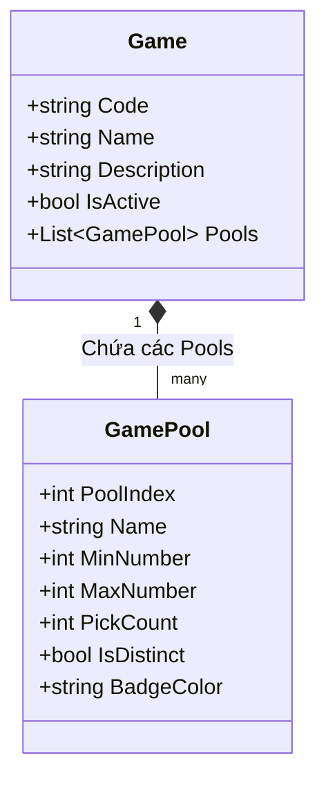

# 📜 QUY TẮC TRÒ CHƠI & CẤU TRÚC PHIẾU (GAME RULES & SLIP SPEC)
# Dự án: Bịp lót — *Cơ hội để nát hơn*

---

## 1. NGUYÊN TẮC TRỪU TƯỢNG HÓA LUẬT CHƠI (GAME RULE ABSTRACTION)

Một sai lầm phổ biến khi xây dựng các ứng dụng xổ số là giả định: *Mọi trò chơi đều chỉ có 1 dải số từ `MinNumber` đến `MaxNumber` và chọn ra `PickCount` số*.

Để hỗ trợ đầy đủ các thể thức xổ số hiện đại (ví dụ: Lotto 5/35 có 2 dải số độc lập: dãy số chính và dãy số đặc biệt/bonus), **Bịp lót** áp dụng mô hình **Multi-Pool Architecture**.

### 1.1. Khái niệm Pool (Tập số)
Một **Game** gồm một hoặc nhiều **GamePools**. Mỗi Pool định nghĩa:
- `PoolIndex`: Thứ tự của tập số (0: Pool chính, 1: Pool phụ/đặc biệt).
- `Name`: Tên hiển thị (ví dụ: "Số chính", "Số đặc biệt").
- `MinNumber`: Giá trị số nhỏ nhất (thường là 1).
- `MaxNumber`: Giá trị số lớn nhất (ví dụ: 55, 45, 35, 12).
- `PickCount`: Số lượng con số bắt buộc phải chọn trong Pool này.
- `AllowDuplicates`: Có cho phép trùng lặp trong cùng một Pool không (Mặc định: `false`).
- `ColorCode`: Màu sắc nhận diện của bóng thuộc Pool này (ví dụ: Đỏ/Cam cho số chính, Vàng kim/Tím cho số đặc biệt).

---

## 2. CHI TIẾT CÁC GAME TRONG PHIÊN BẢN V1



### 2.1. Power 6/55
- **Mã Game (Code):** `POWER_655`
- **Tên hiển thị:** Power 6/55
- **Cấu hình Pools:** Gồm **1 Pool duy nhất**:
  - Pool 0 (Số chính):
    - Dải số: `01` đến `55` (`MinNumber: 1`, `MaxNumber: 55`).
    - Số lượng cần chọn: **6 số** (`PickCount: 6`).
    - Ràng buộc: 6 số phải khác nhau hoàn toàn trong cùng một bộ.

### 2.2. Mega 6/45
- **Mã Game (Code):** `MEGA_645`
- **Tên hiển thị:** Mega 6/45
- **Cấu hình Pools:** Gồm **1 Pool duy nhất**:
  - Pool 0 (Số chính):
    - Dải số: `01` đến `45` (`MinNumber: 1`, `MaxNumber: 45`).
    - Số lượng cần chọn: **6 số** (`PickCount: 6`).
    - Ràng buộc: 6 số phải khác nhau hoàn toàn trong cùng một bộ.

### 2.3. Lotto 5/35
- **Mã Game (Code):** `LOTTO_535`
- **Tên hiển thị:** Lotto 5/35
- **Cấu hình Pools:** Gồm **2 Pools độc lập**:
  - **Pool 0 (Dãy số chính):**
    - Dải số: `01` đến `35` (`MinNumber: 1`, `MaxNumber: 35`).
    - Số lượng cần chọn: **5 số** (`PickCount: 5`).
    - Ràng buộc: 5 số chính phải khác nhau hoàn toàn.
  - **Pool 1 (Dãy số đặc biệt - Special/Bonus Number):**
    - Dải số: `01` đến `12` (`MinNumber: 1`, `MaxNumber: 12`).
    - Số lượng cần chọn: **1 số** (`PickCount: 1`).
    - Ràng buộc: Độc lập với Pool 0 (Số ở Pool 1 có thể trùng giá trị với số ở Pool 0 mà vẫn hợp lệ).

---

## 3. CẤU TRÚC PHIẾU SỐ (SLIP ARCHITECTURE)

Một phiếu số (Slip) mô phỏng cấu trúc của tờ phiếu đăng ký dự thưởng thực tế ngoài đời.

```text
┌───────────────────────────────────────────────────────────┐
│                      BỊP LÓT TICKET                       │
│  Game: Power 6/55                  Ngày tạo: 26/08/2026   │
├───────────────────────────────────────────────────────────┤
│ [A]  (07)   (14)   (28)   (33)   (42)   (51)   [Mixed]    │
│ [B]  (03)   (19)   (22)   (35)   (40)   (55)   [Lucky]    │
│ [C]  (01)   (08)   (15)   (24)   (37)   (49)   [ThầnTài]  │
│ [D]  -- Trống / Chưa chọn --                              │
│ [E]  -- Trống / Chưa chọn --                              │
│ [F]  -- Trống / Chưa chọn --                              │
├───────────────────────────────────────────────────────────┤
│ Tagline: "Cơ hội để nát hơn"            Mã vé: #BIP-99881 │
└───────────────────────────────────────────────────────────┘
```

### 3.1. Các dòng bộ số (Slip Lines)
- Mỗi phiếu hỗ trợ tối đa **6 dòng bộ số**, được gán nhãn: `A`, `B`, `C`, `D`, `E`, `F`.
- **Trạng thái từng dòng (Line Status):**
  - `Empty`: Chưa có số nào được chọn.
  - `Partial`: Đang chọn dở (ví dụ mới chọn 3/6 số).
  - `Complete`: Đã đủ số lượng theo quy tắc của Game.
- Người chơi có quyền lưu hoặc in phiếu kể cả khi chỉ có 1 dòng hoàn thành (ví dụ chỉ hoàn thành dòng A).

### 3.2. Cấu trúc dữ liệu chi tiết của từng con số (Number-Level Metadata)
Khác với các ứng dụng thông thường chỉ lưu mảng số nguyên `[7, 14, 28, 33, 42, 51]`, Bịp lót lưu vết **nguồn gốc xuất xứ (Provenance)** của từng con số:

```json
{
  "lineLabel": "A",
  "numbers": [
    {
      "value": 7,
      "poolIndex": 0,
      "source": "Manual",
      "metadata": null
    },
    {
      "value": 14,
      "poolIndex": 0,
      "source": "Lucky",
      "metadata": {
        "questionId": 102,
        "questionText": "Sáng nay đi làm gặp chuyện gì?",
        "choiceId": 408,
        "choiceText": "Bị dắt xe trễ 15 phút vì tắc thang máy",
        "revealedAt": "2026-08-26T11:45:00Z"
      }
    },
    {
      "value": 28,
      "poolIndex": 0,
      "source": "Random",
      "metadata": {
        "strategy": "Balanced"
      }
    }
  ]
}
```

---

## 4. QUY TẮC RÀNG BUỘC VÀ HIỂN THỊ (VALIDATION & PRESENTATION)

### 4.1. Quy tắc định dạng số
- Mọi con số hiển thị trên giao diện người dùng đều được định dạng 2 chữ số (padding zero): `01`, `02`, ..., `09`, `10`, ..., `55`.

### 4.2. Quy tắc sắp xếp (Sorting Rules)
- **Trong quá trình chơi Lucky Journey:** Các số được hiển thị theo **thứ tự thời gian mở thưởng (Chronological Reveal Order)** để giữ nguyên cảm xúc kịch tính của câu chuyện.
- **Khi hiển thị trên Phiếu hoàn chỉnh / Tổng quan:**
  - Từng Pool được sắp xếp **Tăng dần (Ascending)** để người chơi dễ dàng đối chiếu với kết quả mở thưởng ngoài đời thực.
  - Các Pool khác nhau được phân tách trực quan (ví dụ: Lotto 5/35 hiển thị 5 bóng màu Đỏ/Cam cách một khoảng với 1 bóng màu Vàng kim đặc biệt).

### 4.3. Ràng buộc toàn vẹn khi sinh số (Validation Constraints)
1. **Không trùng lặp trong Pool:** Khi một số $X$ được chọn vào Pool $P$, số $X$ lập tức bị đưa vào danh sách loại trừ (`ExcludedNumbers`) của Pool $P$ trong dòng hiện tại.
2. **Kiểm tra biên (Boundary Check):** $MinNumber \le X \le MaxNumber$.
3. **Tính độc lập giữa các dòng:** Số đã chọn ở dòng A không làm ảnh hưởng đến tập số có thể chọn ở dòng B, C, D, E, F.
