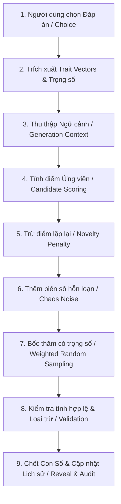
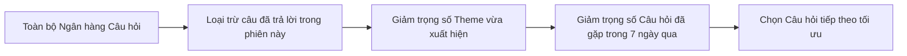

# 🧠 THUẬT TOÁN LUCKY ENGINE & NOVELTY ENGINE
# Dự án: Bịp lót — *Cơ hội để nát hơn*

---

## 1. NGUYÊN TẮC CỐT LÕI (CORE PHILOSOPHY)

> **Tuyệt đối KHÔNG sử dụng bảng ánh xạ tĩnh (No Static Mapping)**  
> *Không bao giờ gán cứng: "Màu Xanh = 17", "Con Mèo = 04", hay "Bị sếp mắng = 49".*

Nếu một người chơi chọn lại cùng một đáp án vào ngày hôm sau, hoặc hai người chơi cùng chọn một đáp án trong cùng một giây, họ **phải có xác suất nhận được các con số khác nhau nhưng vẫn giữ được "âm hưởng/tính cách" của sự lựa chọn đó**.

---

## 2. QUY TRÌNH XỬ LÝ ĐA TẦNG (MULTI-STAGE PIPELINE)

---

## 3. TOÁN HỌC & GIẢI THUẬT CHI TIẾT

### 3.1. Bước 1: Trait Vectors từ Lựa chọn (Choice Traits)
Mỗi lựa chọn $C$ được gắn với một tập các thuộc tính tâm lý/vận mệnh (Traits) kèm cường độ $w_t \in [-1.0, +1.0]$:
$$\vec{T}_C = \{ (t_1, w_1), (t_2, w_2), \dots, (t_k, w_k) \}$$
*Ví dụ:* Lựa chọn *"Bật lại sếp và nộp đơn nghỉ việc"* mang:
- `Trait: ChaosEnergy` $= +0.9$
- `Trait: RiskTolerance` $= +0.8$
- `Trait: Patience` $= -0.7$

### 3.2. Bước 2: Độ cộng hưởng Số học (Number Arithmetic Affinity)
Mỗi con số $n$ trong dải số hợp lệ ($Min \le n \le Max$) có những đặc tính số học tự nhiên:
- Tính chẵn/lẻ (`IsEven`)
- Tính nguyên tố (`IsPrime`)
- Tổng các chữ số (`DigitSum`)
- Căn số học / Căn số bí truyền (`DigitRoot` $= 1 + (n - 1) \pmod 9$)
- Vùng dải số (`Low`: nửa dưới, `High`: nửa trên)

Hệ thống tính **Hệ số cộng hưởng** giữa Trait và đặc tính số học $R(n, \vec{T}_C)$:
$$R(n, \vec{T}_C) = \sum_{t \in \vec{T}_C} w_t \cdot \text{Affinity}(n, t)$$

### 3.3. Bước 3: Hàm tính trọng số ứng viên (Candidate Scoring Formula)
Với mỗi con số $n \in \text{Pool} \setminus \text{ExcludedNumbers}$, trọng số ứng viên $W(n)$ được tính theo công thức:

$$W(n) = \max\left(1.0, \; \text{BaseWeight} + \alpha \cdot R(n, \vec{T}_C) - \beta \cdot \text{NoveltyPenalty}(n) + \gamma \cdot \text{ChaosNoise}(n)\right)$$

Trong đó:
- $\text{BaseWeight} = 10.0$ (Đảm bảo mọi số luôn có xác suất nền tảng cơ bản $>0$).
- $\alpha = 5.0$ (Hệ số tác động của Trait).
- $\beta = 4.0$ (Hệ số phạt nếu số này vừa xuất hiện quá nhiều lần gần đây với người chơi đó).
- $\text{NoveltyPenalty}(n) = \sum_{h \in \text{RecentHistory}} \frac{1}{\Delta t_h + 1}$.
- $\gamma = 2.0$ (Biến số nhiễu động ngẫu nhiên để chống đoán trước).
- $\text{ChaosNoise}(n) \sim \mathcal{U}(-1.0, 1.0)$ sinh từ hàm ngẫu nhiên bảo mật (`RNGCryptoServiceProvider` / `RandomNumberGenerator`).

### 3.4. Bước 4: Lấy mẫu ngẫu nhiên theo trọng số (Weighted Random Sampling)
Sử dụng thuật toán **Roulette Wheel Selection** hoặc **Walker's Alias Method**:
1. Tính tổng trọng số: $S = \sum_{n} W(n)$.
2. Sinh số ngẫu nhiên thực $r \sim \mathcal{U}(0, S)$.
3. Tìm số $n^*$ sao cho tổng tích lũy vừa vượt qua $r$.
4. Trả về $n^*$ làm con số được mở thưởng.

---

## 4. NOVELTY ENGINE (BỘ ĐIỀU PHỐI CHỐNG LẶP & ĐA DẠNG HÓA NỘI DUNG)

Một vấn đề lớn của các hệ thống tạo nội dung là người chơi hay gặp lại cùng 1 câu hỏi hoặc các chủ đề bị lặp lại dày đặc. Novelty Engine giải quyết triệt để vấn đề này:

### 4.1. Quy tắc phân phối Câu hỏi (Question Selection Algorithm)
Khi cần hiển thị câu hỏi tiếp theo cho người chơi:
1. **Loại trừ tuyệt đối:** Những câu hỏi đã trả lời trong cùng một dòng vé hiện tại.
2. **Hệ số hồi chiêu Chủ đề (Theme Cooldown Factor):**
   - Nếu câu hỏi vừa rồi thuộc chủ đề `Công sở`, chủ đề `Công sở` sẽ bị giảm $70\%$ xác suất được chọn ở câu ngay tiếp theo, ưu tiên đổi sang `Tình duyên`, `Tâm linh meme` hoặc `Tài chính đu đỉnh`.
3. **Lịch sử người dùng (User Question History):**
   - Lưu vết danh sách câu hỏi theo `UserId` (với Member) hoặc `SessionToken` (với Guest).
   - Câu hỏi đã gặp trong vòng 24 giờ qua bị giảm $80\%$ trọng số xuất hiện.

---

## 5. CÁC PHONG CÁCH TẠO SỐ CỦA "THẦN TÀI" (RANDOM STRATEGIES)

Ngoài Lucky Journey, chế độ Thần Tài cung cấp 4 phong cách ngẫu nhiên toán học:

| Phong cách | Tên kỹ thuật | Mô tả giải thuật toán học |
| :--- | :--- | :--- |
| **Pure Random** | `PURE_RANDOM` | Sinh $k$ số hoàn toàn ngẫu nhiên bằng bộ sinh số bảo mật CSPRNG, không áp dụng bất kỳ bộ lọc phân phối nào. |
| **Balanced** | `BALANCED` | Ràng buộc: Tỷ lệ Chẵn/Lẻ rơi vào khoảng $3:3$, $2:4$ hoặc $4:2$. Tỷ lệ Nửa Thấp ($1 \le n \le \frac{Max}{2}$) và Nửa Cao cân bằng. |
| **Spread** | `SPREAD` | Chia toàn bộ dải số thành $k$ phân vùng đều nhau (Buckets). Mỗi phân vùng bắt buộc bốc ra đúng 1 số, loại trừ các số liền kề ($|n_i - n_j| \ge 2$). |
| **Surprise** | `SURPRISE` | Ưu tiên chọn các dãy số có tính chất "dị biệt" hoặc cấu trúc đặc biệt (dãy số liên tiếp $3$ số, các số tận cùng giống nhau, số gương lật...). |
