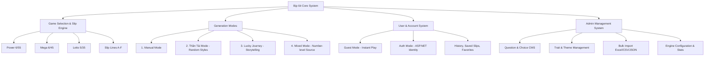

# 🎯 ĐẶC TẢ SẢN PHẨM (PRODUCT SPECIFICATION)
# Dự án: Bịp lót — *Cơ hội để nát hơn*

---

## 1. TỔNG QUAN VÀ TẦM NHÌN SẢN PHẨM (VISION & MISSION)

### 1.1. Bối cảnh & Vấn đề (Context & Problem)
Người chơi các loại hình xổ số hiện nay thường gặp 2 xu hướng chính:
- **Tự chọn số (Manual):** Dựa vào ngày sinh, biển số xe, giấc mơ, ngày kỷ niệm... nhưng sau nhiều lần dễ rơi vào cảm giác cạn kiệt ý tưởng.
- **Máy tự chọn (Quick Pick):** Lạnh lùng, thiếu cảm xúc, bấm một nút là xong, không mang lại trải nghiệm giải trí hay câu chuyện nào để chia sẻ.

### 1.2. Định vị sản phẩm (Product Positioning)
**Bịp lót** định vị là một **nền tảng giải trí tương tác thế hệ mới (Interactive Entertainment & Satirical Number Generator)**:
- **Tên thương hiệu:** Bịp lót
- **Khẩu hiệu (Tagline):** *Cơ hội để nát hơn*
- **Sứ mệnh:** Biến quá trình chọn số từ một hành vi thụ động thành một trải nghiệm vui vẻ, hài hước, phản ánh tâm trạng, tính cách và câu chuyện đời thường (áp lực công sở, tình duyên, tài chính, tâm linh meme) của người chơi.
- **Tuyên bố pháp lý & trách nhiệm (Disclaimer):**
  > **Bịp lót là website độc lập, KHÔNG thuộc sở hữu hay liên kết với Công ty Xổ số Điện toán Việt Nam (Vietlott) hay bất kỳ tổ chức xổ số nào. Website không bán vé, không thu tiền cược và KHÔNG cam kết/quảng bá bất kỳ thuật toán nào có thể tăng tỷ lệ trúng thưởng.**

---

## 2. CHÂN DUNG NGƯỜI DÙNG MỤC TIÊU (TARGET AUDIENCE)

1. **Thế hệ trẻ & Dân văn phòng (Gen Z & Millennials - 20 đến 38 tuổi):**
   - Yêu thích meme, nội dung hài hước, tự trào (self-deprecating humor).
   - Thường mua vé số vui cùng đồng nghiệp vào cuối tuần hoặc khi Jackpot lên cao.
2. **Người tìm kiếm trải nghiệm "Tâm linh vui vẻ":**
   - Thích các bài test tính cách (MBTI, Tarot, Horoscope, trắc nghiệm tình huống) và muốn biến kết quả đó thành một điều gì đó thú vị.
3. **Nhóm bạn / Đồng nghiệp mua chung (Syndicate):**
   - Cần một công cụ để cả nhóm cùng vote, cùng trả lời câu hỏi và cười nghiêng ngả trước khi quyết định chọn bộ số.

---

## 3. NGUYÊN TẮC THIẾT KẾ VÀ GIÁ TRỊ CỐT LÕI (CORE PRINCIPLES)

| Nguyên tắc | Diễn giải cụ thể |
| :--- | :--- |
| **Vui & Châm biếm văn minh** | Châm biếm sự "nát", áp lực deadline, chuyện "đu đỉnh", tình duyên lận đận nhưng với tinh thần lạc quan, tích cực. |
| **Không quá Casino** | Tránh giao diện cờ bạc đen tối, lòe loẹt kiểu casino lừa đảo. Hướng tới phong cách **Hiện đại, Sạch sẽ, Premium & Editorial**. |
| **Mobile-First & Zero Friction** | Người dùng mở web trên điện thoại là có thể chơi ngay lập tức (Guest Mode) trong vòng 5 giây, không bắt ép đăng ký/đăng nhập rườm rà. |
| **Data-Driven & Non-Deterministic** | Mọi câu hỏi, lựa chọn, trọng số đều lưu ở CSDL. Không hard-code kết quả cố định; cùng một lựa chọn ở các thời điểm khác nhau sẽ mang lại sự biến thiên thú vị. |

---

## 4. MA TRẬN TÍNH NĂNG CHI TIẾT (FEATURE MATRIX - V1)

### 4.1. Danh mục Game hỗ trợ (V1)
- **Power 6/55:** Chọn 6 số từ tập `01 - 55`.
- **Mega 6/45:** Chọn 6 số từ tập `01 - 45`.
- **Lotto 5/35:** 
  - 5 số chính từ tập `01 - 35`.
  - 1 số đặc biệt từ tập `01 - 12`.
*(Kiến trúc Backend trừu tượng hoá `GamePool`, không hard-code cấu trúc 1 pool duy nhất).*

### 4.2. Quản lý Phiếu số (Slip System)
- Mỗi phiếu mô phỏng định dạng chuẩn của tấm vé thực tế với tối đa 6 bộ số: **Bộ A, Bộ B, Bộ C, Bộ D, Bộ E, Bộ F**.
- Người chơi có thể sinh riêng từng bộ (ví dụ chỉ tạo Bộ A và Bộ C) hoặc bấm sinh hàng loạt cả 6 bộ.
- Tính năng bổ trợ: Sao chép nhanh, Chụp ảnh/Xuất vé đẹp để chia sẻ mạng xã hội (Share Card), Xoá từng bộ hoặc làm mới cả phiếu.

### 4.3. 4 Chế độ tạo số (Generation Modes)
1. **Manual (Thủ công):** Người dùng tự tay chạm chọn từng số trên lưới bóng.
2. **Thần Tài (Ngẫu nhiên có phong cách):**
   - *Pure Random:* Ngẫu nhiên toán học thuần túy.
   - *Balanced:* Cân bằng chẵn - lẻ, phân bố đều nửa thấp và nửa cao.
   - *Spread:* Trải rộng khoảng cách, hạn chế các cặp số liền kề.
   - *Surprise:* Phá vỡ các quy luật thông thường, tập trung vào các dãy số dị.
3. **Lucky Journey (Hành trình Vận mệnh - Trọng tâm V1):**
   - Sinh từng số một thông qua tương tác trả lời câu hỏi trắc nghiệm hài hước.
   - Câu hỏi 1 $\rightarrow$ Chọn đáp án $\rightarrow$ Tiết lộ ngay Số 1 (Reveal animation + hiệu ứng âm thanh/haptic).
   - Tiếp tục tuần tự cho đến khi hoàn tất đủ bộ số của Game.
4. **Mixed (Hỗn hợp):**
   - Người chơi có thể chọn trước 2 số thủ công (Manual), 2 số từ Lucky Journey và 2 số nhờ Thần Tài gánh.
   - Nguồn gốc của từng con số được lưu trữ độc lập ở cấp độ Cell (`NumberSource: Manual | Lucky | Random`).

### 4.4. Trải nghiệm Khách vãng lai (Guest) vs Thành viên (Logged-in User)

| Quyền lợi / Chức năng | Khách vãng lai (Guest) | Thành viên đăng nhập (Member) |
| :--- | :---: | :---: |
| Trải nghiệm toàn bộ 4 chế độ sinh số | ✅ Có | ✅ Có |
| Tải ảnh phiếu số / Chia sẻ | ✅ Có | ✅ Có |
| Lưu trữ phiếu vào bộ nhớ tạm thời | ✅ LocalStorage | ✅ Cơ sở dữ liệu Cloud |
| Quản lý lịch sử tạo số vĩnh viễn | ❌ Không | ✅ Lưu theo `UserId` |
| Đánh dấu phiếu / bộ số Yêu thích (Favorite) | ❌ Không | ✅ Có |
| Tự động đồng bộ phiếu từ Guest sang Account khi Đăng ký | ❌ Không | ✅ Tự động gộp dữ liệu |
| Mở khóa phân tích "Lucky DNA" cá nhân (V1.5+) | ❌ Không | ✅ Có |

---

## 5. YÊU CẦU PHI CHỨC NĂNG (NON-FUNCTIONAL REQUIREMENTS)

1. **Hiệu năng & Tốc độ phản hồi (Performance):**
   - Thời gian xử lý API sinh số (Lucky Engine / Thần Tài) $< 150\text{ms}$.
   - Tốc độ tải trang ban đầu (First Contentful Paint) $< 1.2\text{s}$ trên mạng di động 4G.
   - Hiệu ứng chuyển cảnh và Reveal số đạt $60\text{fps}$ trên thiết bị di động.
2. **Khả năng mở rộng nội dung (Content Scalability):**
   - Hệ thống dữ liệu câu hỏi được thiết kế chuẩn hoá để chứa hàng chục nghìn câu hỏi mà không làm chậm hệ thống truy vấn.
   - Hỗ trợ phân trang và caching bộ đệm nội dung (`MemoryCache` / In-Memory Store).
3. **Đa ngôn ngữ & Địa phương hoá (Localization):**
   - Giao diện và Content V1 hoàn toàn bằng Tiếng Việt.
   - Cấu trúc kiến trúc sẵn sàng mở rộng i18n trong tương lai.
4. **Bảo mật & Tính tin cậy (Security & Reliability):**
   - Mọi API đều có cơ chế Rate Limiting chống spam/DDoS.
   - Sử dụng chuẩn mã hoá và quản lý người dùng chuẩn mực của ASP.NET Core Identity.
