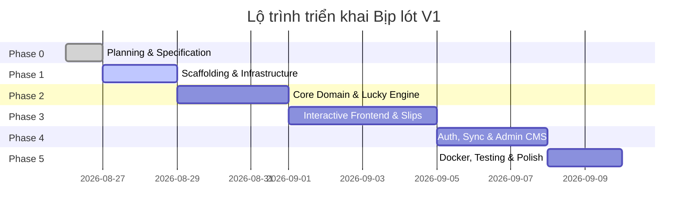

# 🗺️ LỘ TRÌNH TRIỂN KHAI DỰ ÁN (PROJECT ROADMAP & PHASES)
# Dự án: Bịp lót — *Cơ hội để nát hơn*

---

## 1. TỔNG QUAN CÁC GIAI ĐOẠN PHÁT TRIỂN (DEVELOPMENT PHASES)



---

## 2. CHI TIẾT TỪNG GIAI ĐOẠN

### Phase 0: Lập kế hoạch & Tài liệu Đặc tả (Planning & Specifications) — *HIỆN TẠI*
- [x] Khởi tạo Git repository nội bộ.
- [x] Soạn thảo toàn bộ tài liệu đặc tả kiến trúc: `PRODUCT_SPEC.md`, `GAME_RULES.md`, `UX_FLOW.md`, `LUCKY_ENGINE.md`, `CONTENT_SYSTEM.md`, `DATABASE_SPEC.md`, `API_SPEC.md`, `UI_DESIGN.md`, `SECURITY.md`, `ROADMAP.md`, `ACCEPTANCE_CRITERIA.md`.
- [x] Thiết lập bộ quy tắc làm việc cho Agent (`.agents/rules/`).
- [x] Tạo `README.md` tổng quan và đề xuất cấu trúc cây thư mục.

---

### Phase 1: Khởi tạo Bộ khung Dự án & Hạ tầng (Scaffolding & Foundations)
- **Backend:**
  - Khởi tạo ASP.NET Core 9 Web API theo mô hình Modular Monolith / Clean Architecture (`Api`, `Core`, `Application`, `Infrastructure`).
  - Thiết lập EF Core 9 DbContext với SQL Server, cấu hình Entity Mappings và DbSeeder ban đầu (3 Game: Power 6/55, Mega 6/45, Lotto 5/35; Themes & Traits ban đầu).
  - Cấu hình Global Exception Handling Middleware & Logging (Serilog/Console).
- **Frontend:**
  - Khởi tạo Next.js (App Router, TypeScript, Tailwind CSS).
  - Tích hợp `shadcn/ui`, cấu hình Theme Provider (Light/Dark/System) và Design Tokens (bộ màu Đỏ/Cam/Vàng).
- **Môi trường:**
  - Tạo `docker-compose.yml` chạy SQL Server nội bộ cho lập trình.

---

### Phase 2: Hiện thực Thuật toán Sinh số & Hệ thống Nội dung (Engines & Content)
- Xây dựng **Game Rule Engine** (hỗ trợ đa Pool, kiểm tra tính hợp lệ của dải số).
- Hiện thực **Lucky Engine**:
  - Module tính điểm ứng viên (Candidate Scoring Formula).
  - Bốc thăm ngẫu nhiên có trọng số (Weighted Random Sampling).
  - Cơ chế nhiễu động ngẫu nhiên (Chaos Variance) và chống lặp.
- Hiện thực **Novelty Engine**:
  - Thuật toán chọn câu hỏi tiếp theo dựa trên Cooldown chủ đề và lịch sử người dùng.
- Hiện thực **Thần Tài Engine** (4 phong cách: Pure Random, Balanced, Spread, Surprise).
- Nạp ngân hàng câu hỏi mẫu (Seed Data với ~50 câu hỏi đủ 9 loại và các chủ đề vui nhộn).

---

### Phase 3: Giao diện Tương tác & Trải nghiệm Người dùng (UI & Interactive Flow)
- Xây dựng Component **Bóng số 3D (`<LottoBall />`)** và hiệu ứng mở thưởng (Reveal animation).
- Xây dựng Component **Thẻ câu hỏi (`<QuestionCard />`)** tương tác cho các loại câu hỏi (ThisOrThat, Slider, SingleChoice...).
- Hoàn thiện trang **Tạo số Lucky Journey** mượt mà, cảm giác hồi hộp qua từng câu hỏi.
- Xây dựng Component **Phiếu vé (`<SlipTicket />`)** quản lý 6 dòng A-F, Drawer trượt trên mobile.
- Hiện thực chế độ **Manual**, **Thần Tài** và **Mixed Mode**.

---

### Phase 4: Tài khoản, Đồng bộ Dữ liệu & Quản trị (Auth, Sync & Admin CMS)
- Tích hợp **ASP.NET Core Identity + JWT**: Đăng ký, Đăng nhập, Quản lý phiên.
- Hiện thực tính năng **Tự động hợp nhất dữ liệu (Guest to User Data Sync)**: Gộp các phiếu từ LocalStorage vào Database khi người dùng đăng nhập.
- Xây dựng trang **Lịch sử & Phiếu đã lưu**.
- Xây dựng **Admin CMS Portal**:
  - Giao diện quản lý ngân hàng câu hỏi, chủ đề, traits.
  - Wizard **Bulk Import câu hỏi qua file Excel / CSV** kèm kiểm tra lỗi tức thì (Dry-run).
  - Bảng điều khiển cấu hình trọng số Lucky Engine.

---

### Phase 5: Đóng gói Docker, Kiểm thử & Tinh chỉnh (Docker, QA & Polish)
- Viết `Dockerfile` tối ưu nhiều tầng (Multi-stage build) cho Frontend và Backend.
- Hoàn thiện file `docker-compose.yml` hoàn chỉnh để chạy toàn bộ hệ thống bằng:
  ```bash
  docker compose up -d
  ```
- Viết Unit Tests & Integration Tests cho Game Rules, Lucky Engine và API Endpoints.
- Tối ưu hiệu năng, giảm bundle size, kiểm tra tương thích trên iOS Safari và Android Chrome.

---

## 3. PHÂN TÍCH RỦI RO & PHƯƠNG ÁN DỰ PHÒNG (RISK MATRIX)

| Rủi ro tiềm ẩn | Mức độ | Phương án phòng ngừa & Xử lý |
| :--- | :---: | :--- |
| **Cảm giác câu hỏi bị lặp lại khi chơi nhiều lần** | Cao | Thiết kế Novelty Engine với hệ số phạt giảm trọng số câu hỏi cũ; Hỗ trợ Admin Import hàng trăm câu mới dễ dàng qua Excel. |
| **Hiệu năng thuật toán Lucky khi dữ liệu lớn** | Trung bình | Tính toán trọng số trên tập số giới hạn của Pool (tối đa 55 số), toàn bộ giải thuật chạy trong bộ nhớ máy chủ trong vòng $< 5\text{ms}$. |
| **Mất dữ liệu phiếu số của Khách vãng lai** | Trung bình | Lưu trữ song song ở cả LocalStorage và Database (gắn mã `GuestSessionToken`), tự động gộp khi tạo tài khoản. |
| **Nhầm lẫn thương hiệu với Vietlott** | Thấp | Tuyên bố miễn trừ trách nhiệm (Disclaimer) rõ ràng ở chân trang; Bộ nhận diện màu sắc, logo và phong cách hoàn toàn độc lập. |
