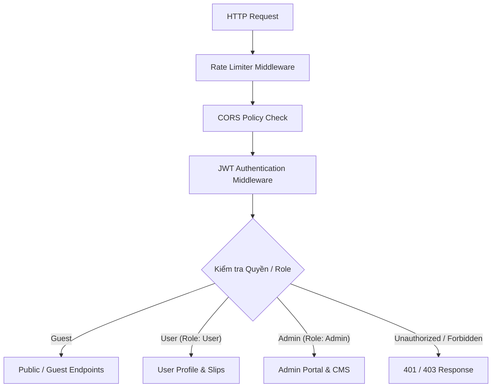

# 🔒 CHÍNH SÁCH BẢO MẬT & XÁC THỰC (SECURITY SPECIFICATION)
# Dự án: Bịp lót — *Cơ hội để nát hơn*

---

## 1. NGUYÊN TẮC BẢO MẬT CỐT LÕI

1. **Tuyệt đối không tự viết thuật toán mã hóa hoặc băm mật khẩu.** Sử dụng toàn bộ hạ tầng đã được kiểm chứng của `Microsoft.AspNetCore.Identity`.
2. **Nguyên tắc quyền tối thiểu (Principle of Least Privilege):** Khách vãng lai (Guest) chỉ có quyền đọc nội dung công khai và tạo số tạm; Thành viên (User) chỉ có quyền truy cập dữ liệu của chính mình; Quản trị viên (Admin) yêu cầu kiểm tra Token và Role nghiêm ngặt.
3. **Phòng thủ đa tầng (Defense in Depth):** Bảo vệ từ lớp API Gateway/Reverse Proxy, Middleware, Validation đến tầng Database.

---

## 2. KIẾN TRÚC XÁC THỰC & PHÂN QUYỀN (AUTH & RBAC)

### 2.1. Quản lý Tài khoản & Mật khẩu (ASP.NET Core Identity)
- Mật khẩu người dùng được băm tự động bằng chuẩn **PBKDF2** với Salt ngẫu nhiên 128-bit và số vòng lặp mặc định theo chuẩn của .NET.
- **Chính sách mật khẩu (Password Policy):**
  - Độ dài tối thiểu: 8 ký tự.
  - Yêu cầu ít nhất: 1 chữ hoa, 1 chữ thường, 1 chữ số.
- Cơ chế khóa tài khoản tạm thời (Lockout): Khóa 15 phút nếu nhập sai mật khẩu liên tiếp 5 lần để chống tấn công Brute-Force.

### 2.2. Cơ chế Token (JWT Access & Refresh Token)
- **Access Token:**
  - Thời gian sống ngắn: $15 - 30$ phút.
  - Chứa Claims: `UserId`, `Email`, `Role`, `SecurityStamp`.
  - Ký bằng thuật toán `HmacSha256` với `SecretKey` an toàn trong biến môi trường.
- **Refresh Token:**
  - Thời gian sống: $7 - 30$ ngày.
  - Lưu trữ an toàn trong Database kèm mã định danh thiết bị (`DeviceId`) và trạng thái thu hồi (`IsRevoked`).
  - Hỗ trợ lưu trữ trong Cookie trình duyệt với cờ `HttpOnly`, `Secure`, `SameSite=Strict`.

---

## 3. BẢO VỆ TẦNG DỮ LIỆU & TRUY VẤN (DATA PROTECTION)

### 3.1. Chống SQL Injection
- Toàn bộ truy vấn đọc/ghi đều thông qua **Entity Framework Core** với Parameterized Queries.
- Tuyệt đối không ghép chuỗi thô (`Raw SQL Concatenation`) khi thực thi lệnh Database.

### 3.2. Chống XSS (Cross-Site Scripting)
- Toàn bộ nội dung câu hỏi, đáp án, tiêu đề phiếu từ người dùng đều được làm sạch (Sanitize) tại Backend trước khi lưu.
- Frontend Next.js / React tự động escape HTML entities khi render.

### 3.3. Xác thực Dữ liệu đầu vào (FluentValidation)
- Mọi DTO gửi lên từ client đều được kiểm tra chặt chẽ bởi `FluentValidation`:
  - Mã Game phải tồn tại trong hệ thống.
  - Số lượng số được chọn phải trùng khớp với `PickCount` của từng `GamePool`.
  - Giá trị số phải nằm trong khoảng $[MinNumber, MaxNumber]$ và không trùng lặp trong cùng một Pool.

---

## 4. CHỐNG SPAM & TẤN CÔNG TỪ CHỐI DỊCH VỤ (RATE LIMITING & ANTI-ABUSE)

Sử dụng `Microsoft.AspNetCore.RateLimiting` tích hợp sẵn trong ASP.NET Core:

| Phân vùng API | Giới hạn (Rate Limit) | Thuật toán áp dụng |
| :--- | :--- | :--- |
| **Auth APIs** (`/api/v1/auth/*`) | 10 requests / phút / IP | Fixed Window |
| **Generation APIs** (`/api/v1/lucky-journey/*`, `/than-tai/*`) | 60 requests / phút / IP | Sliding Window |
| **Admin Import APIs** (`/api/v1/admin/content/*`) | 5 requests / phút / User | Token Bucket |
| **General Public APIs** | 120 requests / phút / IP | Sliding Window |

---

## 5. CẤU HÌNH BIẾN MÔI TRƯỜNG & BẢO MẬT DOCKER

- Không commit bất kỳ Secret Key, Database Password, hoặc JWT Secret vào Git Repository.
- Sử dụng file `.env.example` làm mẫu cấu hình.
- Trong môi trường Docker:
  - Database SQL Server chỉ mở cổng trong mạng nội bộ (`internal network`) giữa backend và database, không phơi bày cổng `1433` ra ngoài Internet công cộng trong môi trường Production.
  - Container chạy dưới quyền người dùng không đặc quyền (`non-root user`).
