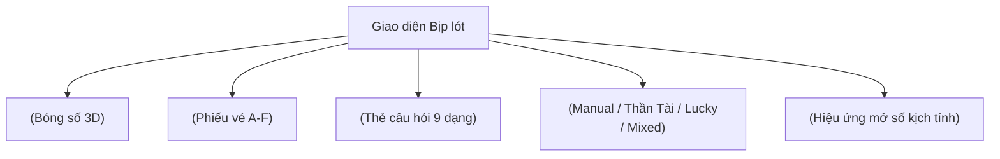

# 🎨 THIẾT KẾ GIAO DIỆN & TRẢI NGHIỆM THỊ GIÁC (UI DESIGN SPEC)
# Dự án: Bịp lót — *Cơ hội để nát hơn*

---

## 1. HỆ THỐNG NHẬN DIỆN THƯƠNG HIỆU (BRAND IDENTITY & DESIGN TOKENS)

### 1.1. Bảng màu Chủ đạo (Brand Color Palette)
Thương hiệu Bịp lót xây dựng dựa trên bộ ba màu năng lượng: **Đỏ (Red) - Cam (Orange) - Vàng (Yellow)**. Được tinh chỉnh theo phong cách hiện đại (Neo-brutalism pha lẫn Glassmorphism), tránh cảm giác sòng bạc đỏ đen truyền thống.

| Token | Tên màu | Mã Hex (Light) | Mã Hex (Dark) | Ứng dụng |
| :--- | :--- | :---: | :---: | :--- |
| `color-primary` | Đỏ Bịp (Fire Red) | `#E11D48` (`rose-600`) | `#F43F5E` (`rose-500`) | Nút CTA chính, Bóng số chính, Điểm nhấn thương hiệu |
| `color-secondary`| Cam Bùng Nổ (Electric Orange) | `#F97316` (`orange-500`)| `#FB923C` (`orange-400`)| Chế độ Thần Tài, Hiệu ứng chuyển động, Highlight |
| `color-accent` | Vàng Tài Lộc (Golden Yellow) | `#FACC15` (`amber-400`) | `#FDE047` (`amber-300`) | Bóng số đặc biệt, Jackpot badge, Ánh sáng phát quang |
| `color-bg` | Màu nền (Canvas) | `#FAFAFA` (`zinc-50`) | `#09090B` (`zinc-950`)| Nền tổng thể ứng dụng |
| `color-surface` | Bề mặt (Card/Sheet) | `#FFFFFF` (`white`) | `#18181B` (`zinc-900`)| Thẻ câu hỏi, Phiếu vé, Hộp thoại |
| `color-border` | Đường viền (Border) | `#E4E4E7` (`zinc-200`)| `#27272A` (`zinc-800`)| Viền thẻ, Rãnh ngăn cách |

---

### 1.2. Kiểu chữ (Typography)
- **Phông chữ giao diện chính (Body & UI):** `Plus Jakarta Sans` hoặc `Inter` — Hiện đại, dễ đọc trên màn hình điện thoại ở kích thước nhỏ.
- **Phông chữ hiển thị số bóng (Lotto Numbers):** `Outfit` hoặc `JetBrains Mono` (Bold) — Tròn trịa, cân đối và nổi bật khi hiển thị trong khối cầu 3D.
- **Tone & Voice (Giọng văn):**
  - Châm biếm hóm hỉnh: *"Hôm nay bạn định nát theo cách nào?"*, *"Thần tài đang xem xét hồ sơ nghèo của bạn..."*.
  - Dễ chịu, không mỉa mai tiêu cực, tạo cảm giác giải tỏa căng thẳng sau giờ làm.

---

## 2. HỆ THỐNG COMPONENT CỐT LÕI (CORE UI COMPONENTS)



### 2.1. Component Bóng Số (`<LottoBall />`)
- Thiết kế hình cầu với Gradient radial tạo chiều sâu 3D.
- **Các trạng thái (States):**
  - `Empty`: Vòng tròn nét đứt viền xám mờ `[ ? ]`.
  - `Revealing`: Rung lắc, phát sáng xung quanh (glow effect).
  - `Active / Revealed`: Tô màu gradient đầy đủ theo từng Pool, hiển thị 2 chữ số căn giữa.
  - `Source Badge`: Một chấm nhỏ hoặc icon tinh tế ở góc bóng thể hiện nguồn gốc:
    - 🔵 Xanh dương nhạt: `Manual`
    - 🟣 Tím phát sáng: `Lucky`
    - 🟡 Vàng kim: `Random (Thần Tài)`

```text
       ┌───────────┐
       │   .-"".   │   <-- Nguồn Lucky (Tím neon)
       │  /  28 \  │   <-- Số hiển thị 2 chữ số (Bold)
       │  \     /  │
       │   `-..-'  │   <-- Đổ bóng 3D dưới chân
       └───────────┘
```

---

### 2.2. Component Phiếu Vé (`<SlipTicket />`)
- Mô phỏng chiếc vé số vật lý hiện đại:
  - Đường viền răng cưa (Perforated ticket edge) ở hai mép.
  - Header in tên game + Logo thương hiệu Bịp lót + Tagline *"Cơ hội để nát hơn"*.
  - Thân phiếu chia 6 hàng rõ ràng: `A`, `B`, `C`, `D`, `E`, `F`.
  - Footer chứa mã vé Barcode / QR Code meme và nút bấm nhanh: "Sao chép bộ số", "Tải ảnh khoe bạn bè".

---

### 2.3. Component Thẻ Câu hỏi (`<QuestionCard />`)
- Card nổi bật ở trung tâm màn hình, hỗ trợ hiệu ứng chuyển trang (Card Flip & Slide transitions) mượt mà bằng `Framer Motion`.
- Tự động thay đổi Layout linh hoạt tùy theo `QuestionType`:
  - `ThisOrThat`: 2 nút so sánh kích thước lớn $50/50$.
  - `Slider`: Thanh trượt cảm xúc màu gradient từ Vàng sang Đỏ rực.
  - `BlindChoice`: 3 lá bài úp mặt hiệu ứng hologram bí ẩn.

---

## 3. BỐ CỤC MOBILE-FIRST & RESPONSIVE

### 3.1. Giao diện Điện thoại (Mobile View - Ưu tiên hàng đầu)
- **Top Bar:** Logo Bịp lót + Nút đổi Theme (Light/Dark) + Avatar người dùng.
- **Game Bar:** Thanh tab ngang cuộn mượt (Power 6/55 | Mega 6/45 | Lotto 5/35).
- **Khu vực tương tác chính (Main Stage):** Hiển thị màn hình tạo số của dòng hiện tại (Lucky Card hoặc Lưới bóng Manual).
- **Floating Bottom Drawer (Ngăn kéo Phiếu vé):**
  - Thanh tóm tắt ghim cố định ở đáy màn hình: hiển thị tiến độ (ví dụ: `Dòng A: 4/6 số • Dòng B: Đã xong`).
  - Vuốt nhẹ lên để mở toàn bộ Phiếu vé 6 dòng A-F.

### 3.2. Giao diện Máy tính (Desktop View)
- Bố cục 2 cột (Split Screen):
  - **Cột trái (60%):** Sân khấu tương tác tạo số (Interactive Arena).
  - **Cột phải (40%):** Tờ vé số vật lý `<SlipTicket />` hiển thị trực tiếp và cập nhật thời gian thực từng con số vừa được chọn/mở thưởng.
