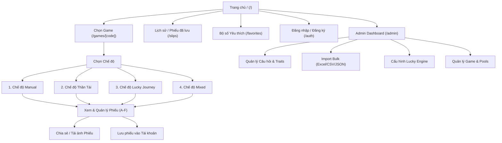
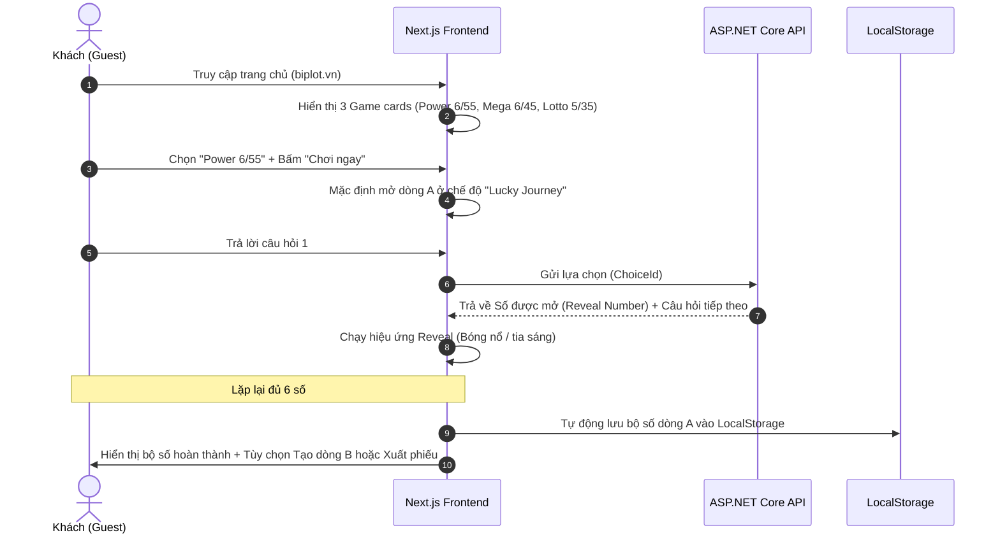
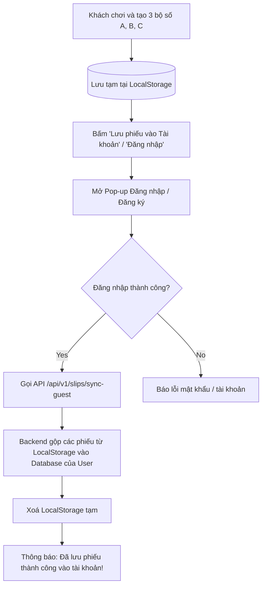

# 🗺️ HÀNH TRÌNH TRẢI NGHIỆM NGƯỜI DÙNG (UX FLOW & WIREFLOW)
# Dự án: Bịp lót — *Cơ hội để nát hơn*

---

## 1. SƠ ĐỒ CẤU TRÚC TRANG (SITE MAP & PAGE HIERARCHY)

---

## 2. CHI TIẾT CÁC LUỒNG TRẢI NGHIỆM CHÍNH (USER JOURNEYS)

### 2.1. Luồng Khách vãng lai (Guest Zero-Friction Flow)
*Mục tiêu: Đưa người dùng từ lúc vào web đến khi cầm trên tay bộ số trong vòng chưa đầy 10 giây.*

---

### 2.2. Luồng Trải nghiệm "Lucky Journey" (Trọng tâm trải nghiệm)
Lucky Journey được thiết kế giống như một minigame tương tác dẫn dắt cảm xúc:

1. **Bắt đầu dòng mới:**
   - Hệ thống hiển thị thanh tiến trình 6 ô bóng trống `[ ? ] [ ? ] [ ? ] [ ? ] [ ? ] [ ? ]`.
2. **Xuất hiện thẻ câu hỏi (Question Card):**
   - Nội dung câu hỏi hài hước (ví dụ: *“Sếp vừa gửi email lúc 17h59 yêu cầu nộp báo cáo, bạn sẽ làm gì?”*).
   - Tùy theo `QuestionType` (Trắc nghiệm, ThisOrThat, Kéo Slider, Chọn biểu tượng bí ẩn...), giao diện render component nhập liệu tương ứng.
3. **Người chơi đưa ra lựa chọn:**
   - Chạm vào đáp án $\rightarrow$ Thẻ câu hỏi phát sáng.
4. **Mở số tức thì (Immediate Dramatic Reveal):**
   - Không đợi trả lời hết 6 câu mới biết kết quả. Ngay sau khi chọn, bóng số hiện tại rung chuyển, nổ hiệu ứng hạt (confetti/particles) và hiện ra con số (ví dụ: `28`).
   - Kèm câu bình luận châm biếm ngắn (ví dụ: *“Số 28: Sự bất lực được số hoá!”*).
5. **Chuyển tiếp câu tiếp theo:**
   - Hệ thống Novelty Engine tự động chọn câu hỏi tiếp theo thuộc Theme khác để tránh nhàm chán.
6. **Hoàn thành dòng:**
   - Đủ 6 bóng $\rightarrow$ Hiệu ứng "Bộ số Vận Mệnh đã sẵn sàng" $\rightarrow$ Tự động điền vào Dòng A của Phiếu.

---

### 2.3. Luồng "Thần Tài" (Random có phong cách)
1. Người dùng chọn dòng muốn tạo (ví dụ: Dòng B).
2. Chọn 1 trong 4 phong cách Thần Tài:
   - **Thần Tài Thuần Túy (Pure Random):** Ngẫu nhiên 100%.
   - **Thần Tài Cân Bằng (Balanced):** Đảm bảo tỷ lệ chẵn/lẻ và dải số cân xứng.
   - **Thần Tài Trải Rộng (Spread):** Tản đều các đầu số (đầu 0x, 1x, 2x, 3x, 4x, 5x).
   - **Thần Tài Bất Ổn (Surprise):** Chọn những tổ hợp "dị" (dãy liên tiếp, số gánh, số đảo).
3. Bấm nút **"Xin số Thần Tài"** $\rightarrow$ Vòng quay vàng xoay nhanh $\rightarrow$ Điền ngay 6 số vào dòng.
4. Có nút **"Lắc lại"** nếu chưa ưng ý.

---

### 2.4. Luồng "Mixed Mode" (Tự do phối trộn)
1. Người dùng mở dòng C.
2. Chạm tay tự chọn 2 số yêu thích: `08` (Manual), `19` (Manual).
3. Nhấn nút **"Nhờ Lucky giải quyết tiếp"** $\rightarrow$ Hệ thống mở 2 câu hỏi Lucky Journey để sinh ra `27` (Lucky), `34` (Lucky).
4. Nhấn nút **"Thần Tài chốt sổ"** $\rightarrow$ Tự động sinh ngẫu nhiên 2 số cuối: `41` (Random), `52` (Random).
5. Kết quả: Dòng C gồm `[08, 19, 27, 34, 41, 52]` với đầy đủ nguồn gốc từng số.

---

### 2.5. Luồng Đăng nhập & Tự động hợp nhất dữ liệu (Auth & Migration Flow)

---

### 2.6. Luồng Quản trị viên (Admin Flow)
1. **Đăng nhập Quản trị:** Truy cập `/admin`, xác thực quyền `Role: Admin`.
2. **Dashboard thống kê:** Xem số lượng phiếu đã tạo hôm nay, game được chơi nhiều nhất, câu hỏi được tương tác nhiều nhất.
3. **Quản lý Ngân hàng câu hỏi (Question Bank):**
   - Tìm kiếm, lọc theo Theme, Loại câu hỏi (`QuestionType`), Trạng thái (`Active/Inactive`).
   - Thêm mới/sửa câu hỏi, gán Traits và độ nặng cho từng đáp án (`ChoiceTraits`).
4. **Import hàng loạt (Bulk Import Wizard):**
   - Tải file mẫu (`template_questions.xlsx` / `.csv`).
   - Kéo thả file lên web $\rightarrow$ Hệ thống kiểm tra cú pháp (Dry Run Validation).
   - Báo lỗi chi tiết từng dòng nếu thiếu cột hoặc sai định dạng $\rightarrow$ Nhấn **"Xác nhận Import"** để ghi vào database.
5. **Cấu hình Lucky & Novelty Engine:**
   - Điều chỉnh hệ số phạt lặp câu hỏi (`RepeatPenaltyFactor`), thời gian cooldown của chủ đề (`ThemeCooldownMinutes`), mức độ ngẫu nhiên hỗn loạn (`ChaosVarianceMultiplier`).
